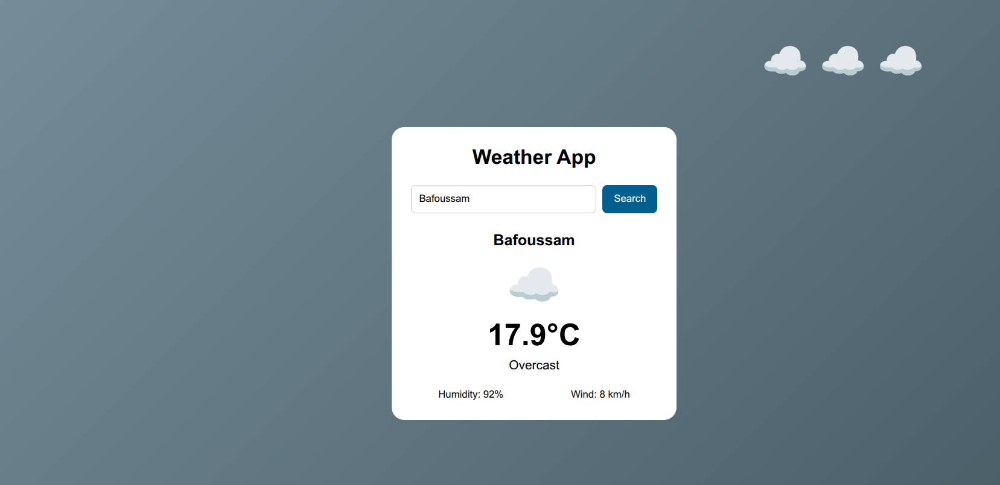

# 🌦️ Weather App

> A responsive web-based weather application built with HTML, CSS, and JavaScript that allows users to search for a city and view real-time weather information through a clean, interactive, and user-friendly interface.

---

## 📌 Problem Statement

Accessing weather information quickly and clearly is useful for everyday planning. This project demonstrates how a web application can fetch real-time weather data from an external API and dynamically display it using only HTML, CSS, and JavaScript.

The project also focuses on creating an interactive experience where the application's background and animations respond to the current weather condition.

---

## 🎯 Project Goals

* Build a responsive weather application
* Practice HTML structure and semantic markup
* Improve CSS styling and responsive layouts
* Learn how to work with external APIs using JavaScript
* Practice asynchronous JavaScript with `fetch()` and `async/await`
* Strengthen DOM manipulation and event-handling skills
* Create weather-based animations using CSS

---

## 🛠 Tech Stack

**Frontend:**

* HTML5
* CSS3
* JavaScript (ES6)

**API:**

* Open-Meteo API

**Other Tools:**

* Git & GitHub
* VS Code

---

## 🖥 Features

* Search for weather by city name
* Display current temperature
* Display humidity
* Display wind speed
* Display weather description
* Dynamic weather emojis based on weather conditions
* Weather-based animated backgrounds
* Animated clouds for cloudy conditions
* Handle empty city searches
* Handle invalid city names
* Responsive and mobile-friendly design
* Clean and simple user interface

---

## 📸 Screenshot



---

## ⚙ Installation & Setup

### 📥 Clone the repository

```bash
git clone git@github.com:Hache-premier/Weather_App.git
cd Weather_App
```

---

### ▶ Run the project

You can open it in your browser in two ways:

**Option 1: Direct Open**

* Open the `index.html` file in your preferred web browser.

**Option 2 (Recommended): Live Server**

* Install the **Live Server** extension in VS Code.
* Right-click `index.html`.
* Select **Open with Live Server**.

---

## 🧠 Challenges Faced

* Connecting the application to the Open-Meteo API
* Converting city names into geographic coordinates
* Fetching and handling weather data asynchronously
* Mapping weather codes to readable weather descriptions
* Updating the interface dynamically using JavaScript
* Creating weather-specific CSS animations
* Handling invalid city searches and empty input
* Keeping the user interface responsive across different screen sizes

---

## 📚 What I Learned

* How to work with external APIs using JavaScript
* How to use `fetch()` to retrieve data from an API
* How `async/await` works with asynchronous operations
* How to manipulate HTML elements using the DOM
* How to use event listeners to respond to user actions
* How to convert API weather codes into meaningful descriptions and icons
* How to create CSS animations that react to application state
* How to build a complete interactive web application using HTML, CSS, and JavaScript

---

## 🚀 Future Improvements

* Add a five-day weather forecast
* Add more detailed weather information
* Improve rain and snow animations
* Add animated weather icons
* Add temperature unit conversion between Celsius and Fahrenheit
* Add a current-location weather feature
* Improve error messages and loading states
* Add a dark/light mode toggle
* Improve accessibility and keyboard navigation

---

## 👨🏽‍💻 Author

**Ndonwi Ashley Cheo**
Software Engineering Student

🌍 Based in Cameroon | Passionate about web development and continuously learning new technologies 🚀

